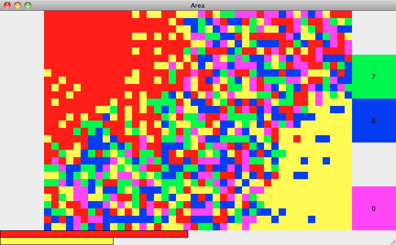

# Area

This is a clone of the two-player browser game [Area](http://www.playforia.net/play/classic/area/), written in Python.



# Installation

## Precompiled package

Download the ready-for-use [release](../../releases) for your operating system.

## Command line

### Dependencies

Install platform-specific dependencies

- Python 2.7
- wxPython 3.0 (graphical interface)

and with `pip`

- tabulate 0.7 (for debugging output)
- hypothesis 3.1 (for unit tests)

The latter two are not strictly necessary to run the game if the appropriate lines in the source are commented out.

### Source code

Clone the source to your local file system with

```
git clone https://github.com/fricklerhandwerk/area
```

### Running

Enter

```
python area/area/gui.py
```

to run the game.


# Usage

To control the game, press the `NUM` keys displayed or click the appropriate player's color buttons.

`BACKSPACE` (`DEL` on Ubuntu) resets the game.

`ESC` quits the game.

The player who first occupies at least half the board wins.


# Differences to the original

## Standalone application

You need to install this game on your computer.

This has some advantages. It loads and runs much faster than the original, which must be downloaded each time you play and is encapsuled in your browser. You can also modify the source code and improve it if you like.

## Played offline at one computer

You nead an actual person next to you to play it.

Other than that, the game is somewhat simpler behind the scenes. It doesn't count rounds and a player cannot give up. Just reset the game.

Also it doesn't have any sounds that indicate which player took the lead. This should be obvious from the score bars.

## Keyboard commands available

If you don't like to share a mouse or trackpad, just press the according keyboard key to choose a color.

Currently you are only offered colors that are available, so you can't accidentally choose a color that doesn't grow your area. If you are completely surrounded by your oppenent's color, you can choose any other, but naturally it won't increase your score.

## Score counts enclosed area

Probably the most notable difference concerns game mechanics. Your score takes all *enclosed* areas into account. That is, parts of the board that are not reachable for your opponent, since they are surrounded by your area, belong to you, even if you have not colored them yet.

There are actually four modes for handling enclosed areas, which you can set in the source code:

- don't count *(original behavior)*
- only count to determine if player has already won
- count as score *(default)*
- color immediately


# Packaging

To provide the game for people not familiar with Python or the command line or not wanting to install dependencies separately, it is possible to package the game as a single executable file.

## Mac OS X

Make sure `py2app` is installed and you are in the source directory.

Then in the command line, enter

```
python setup.py py2app
```

After this in `dist` you will have `Area.app`, which can be distributed and started like any other app by double clicking the app icon.


# To do

## Window scaling

Scaling the window produces artifacts because of the way the board is drawn. This should be rebuilt such that you can scale the window to any size, but always have square cells (± 1 px) and no artifacts. The score bars should compensate for the window's aspect ratio.

## Platform-dependent colors

The game uses color identifiers such as "red" or "green", which are subject to interpretation, but easy to read in the source. Also there are no font settings used, hence key strings on buttons appear in the system default font. Therefore the game may look very different on different operating systems or distributions.

It may be appropriate to fix appearance with numerical color codes.

## Packaging and installation on other operating systems

Please submit packaging and installation instructions for common Linux distributions or Windows!
